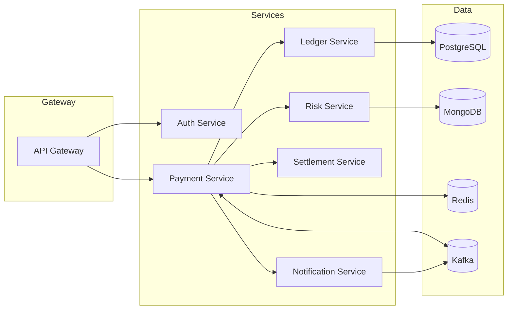

# Cloud-Native Payment Gateway

[](https://github.com/your-user/your-repo/actions/workflows/ci.yml)


Production-grade, microservices-based payment gateway built with **Java 21**, **Spring Boot 3**, **Spring Cloud**, **Kafka**, **PostgreSQL**, **MongoDB**, **Redis**, and deployable to **Docker/Kubernetes**.  
Default profile is **`local`**; future `prod` profile can be added easily.

---

## Quick Start (Local)

### 1) Prereqs
- Java 21, Docker, Docker Compose
- IntelliJ IDEA (recommended)

### 2) Start infra & dependencies
```bash
docker compose -f deploy/local/docker-compose.yml up -d
```

### 3) Run services (IntelliJ)
Open the project, and run each Spring Boot application. No profile flag required — `local` is the default.

### 4) Smoke check
- API Gateway: http://localhost:8080 (adjust if different)
- Payment Service: http://localhost:8081/actuator/health

---

## Architecture



- See **docs/ARCHITECTURE.md** for service responsibilities and flows.
- Observability, security, and deployment guides are in `docs/`.

---

## CI/CD (GitHub Actions)
- Build & test on PRs
- On tags, build & push Docker images to GHCR (`ghcr.io`)

---

## Security
- OAuth2/JWT between services
- TLS termination at gateway/ingress
- Secrets via environment or Vault (recommended in prod)

---

## Observability
- OpenTelemetry instrumentation for traces
- Prometheus scraping for metrics
- Grafana dashboards (starter JSON in `docs/observability/`)

---

## Contributing
See [CONTRIBUTING.md](CONTRIBUTING.md).

---

## License
[MIT](LICENSE)