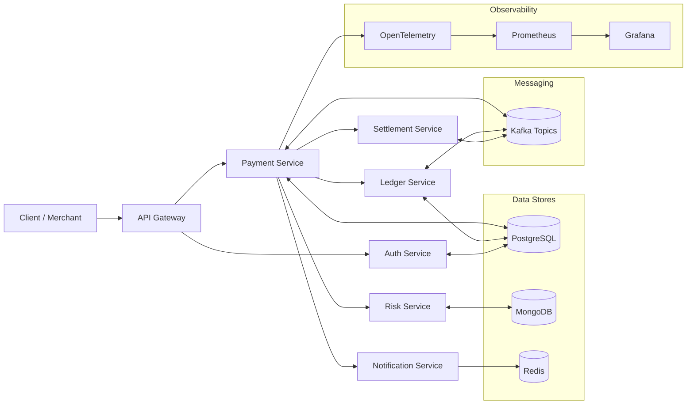

# Cloud-Native Payment Gateway

[](./.github/workflows/ci.yml)
[](./.github/workflows/codeql.yml)
[](LICENSE)

Production-grade, modular payment gateway built with **Java 21**, **Spring Boot 3**, **Spring Cloud**, **Kafka**, **PostgreSQL**, **MongoDB**, **Redis**, **Docker**, **Kubernetes**, **Helm**, **Terraform**, and **GitHub Actions**.

> Last updated: 2025-08-13

## Highlights
- Domain-driven microservices: `payment-service`, `ledger-service`, `settlement-service`, `risk-service`, `notification-service`, `auth-service`, `api-gateway`.
- End-to-end security: TLS, OAuth2/JWT (Keycloak/OIDC), Secrets via Kubernetes and GitHub OIDC to AWS.
- Observability: OpenTelemetry, Prometheus, Grafana, structured logging.
- Deploy anywhere: Docker + Helm charts, K8s manifests, Terraform (AWS EKS), GitOps-ready.
- CI/CD: Build, test, SBOM, vulnerability scan (Trivy), CodeQL, container publish.

## Architecture



## Quickstart (Local)

```bash
# 1) Build all modules
./mvnw -q -DskipTests=false clean verify

# 2) Start dependencies (dev): Kafka, Postgres, Redis, Mongo
docker compose -f deploy/docker-compose.dev.yml up -d

# 3) Run a service (example)
cd services/payment-service && ./mvnw spring-boot:run
```

> See `docs/LOCAL_DEV.md` for detailed instructions and sample `.env`.

## Kubernetes (Helm)

```bash
helm upgrade --install payment-gateway ./helm/payment-gateway   --namespace payments --create-namespace   -f helm/values/dev.yaml
```

## Repository Map
- `.github/workflows/` – CI/CD pipelines
- `docs/` – Guides (local dev, architecture, runbooks)
- `helm/` – Helm charts for services
- `k8s/` – Raw manifests (optional alternative to Helm)
- `infra/terraform/` – EKS cluster, RDS, MSK (Kafka) skeleton
- `adr/` – Architecture Decision Records

## Security
See [SECURITY.md](SECURITY.md). Report issues responsibly.

## License
[Apache-2.0](LICENSE)
