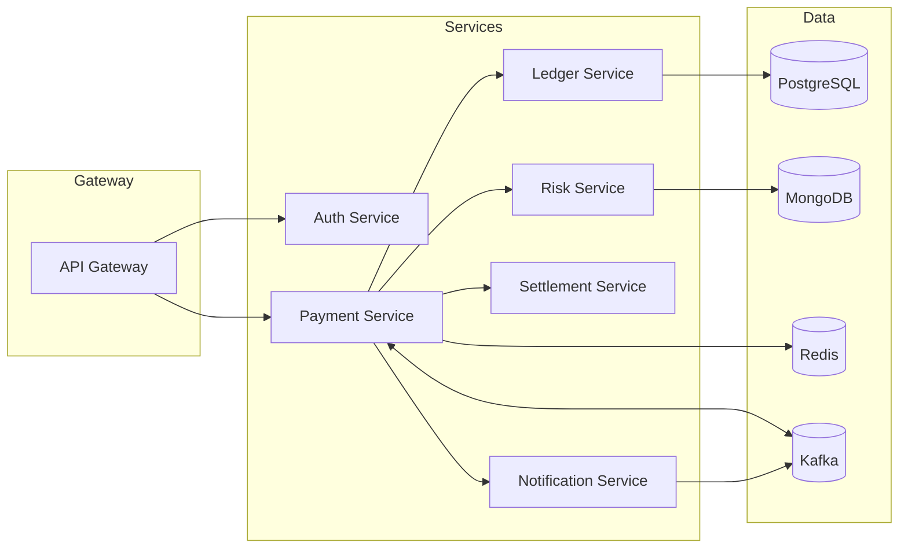

# Cloud-Native Payment Gateway


This repository is a **production-grade, microservices-based payment gateway** built with modern Java and cloud-native best practices. It demonstrates:
- **Microservices architecture** with Spring Boot 3 & Spring Cloud
- **Event-driven design** with Apache Kafka
- **Polyglot persistence** (PostgreSQL, MongoDB, Redis)
- **Full CI/CD pipeline** using GitHub Actions & Docker
- **Kubernetes-ready** deployments with sample manifests
- **Observability** via OpenTelemetry, Prometheus, and Grafana

It’s designed as a **portfolio-grade project** to showcase enterprise-level architecture, DevOps practices, and cutting-edge Java development skills.

---

## Quick Start (Local)

### 1) Prereqs

- Java 21, Docker, Docker Compose
- IntelliJ IDEA (recommended)

### 2) Start infra & dependencies

```bash
docker compose -f deploy/local/docker-compose.yml up -d
```

### 3) Run services (IntelliJ)

Open the project, and run each Spring Boot application. No profile flag required — `local` is the default.

### 4) Smoke check

- API Gateway: http://localhost:8080 (adjust if different)
- Payment Service: http://localhost:8081/actuator/health

---

## Architecture



- See **docs/ARCHITECTURE.md** for service responsibilities and flows.
- Observability, security, and deployment guides are in `docs/`.

---

## CI/CD (GitHub Actions)

- Build & test on PRs
- On tags, build & push Docker images to GHCR (`ghcr.io`)

---

## Security

- OAuth2/JWT between services
- TLS termination at gateway/ingress
- Secrets via environment or Vault (recommended in prod)

---

## Observability

- OpenTelemetry instrumentation for traces
- Prometheus scraping for metrics
- Grafana dashboards (starter JSON in `docs/observability/`)

---

## Contributing

See [CONTRIBUTING.md](CONTRIBUTING.md).

---

## License

[MIT](LICENSE)

## Payment Service – Features Added

- Multiple providers (Stripe, PayPal, Razorpay) via a pluggable `PaymentProvider` interface (stubs included).
- Refunds API and transaction persistence using Spring Data JPA (H2 by default).
- Webhook endpoint stub to receive provider callbacks.
- Input validation, global error handling, and idempotency keys for safe retries.
- OpenAPI docs available at `/swagger-ui.html` when the service is running.

### Quickstart

```bash
# From repository root
./mvnw -q -DskipTests package
java -jar services/payment-service/target/payment-service-1.0.0.jar
```

The service listens on `http://localhost:8081` (configurable with `PORT`).

### Example Requests

Create a payment:
```bash
curl -X POST http://localhost:8081/api/v1/payments \  -H "Content-Type: application/json" \  -d '{"amountMinor": 12345, "currency": "INR", "customerEmail": "demo@example.com", "idempotencyKey": "abc123"}'
```

Refund a payment:
```bash
curl -X POST http://localhost:8081/api/v1/refunds \  -H "Content-Type: application/json" \  -d '{"transactionId": "txn_123", "amountMinor": 12345, "reason": "requested_by_customer"}'
```

### Configuration

Copy `.env.example` and set secrets as environment variables before running in production. Spring Boot automatically reads environment variables referenced in `application.yml` (e.g., `${STRIPE_API_KEY}`).

## Production Setup (No Frontend)

### Run Postgres
```bash
docker compose up -d db
```

### Use the `prod` profile
```bash
./mvnw -q -DskipTests package
java -jar services/payment-service/target/payment-service-1.0.0.jar --spring.profiles.active=prod
```

### Auth
All non-webhook endpoints require an API key:
- Header: `X-API-Key: <your key>`
- Set via env var: `API_KEY`

### Providers
SDK dependencies are included:
- Stripe: `com.stripe:stripe-java`
- PayPal: `com.paypal.sdk:paypal-checkout-sdk`
- Razorpay: `com.razorpay:razorpay-java`

In this repo, SDK calls are stubbed/commented to allow offline builds. To enable real charges:
1. Set your credentials in environment variables (`.env.example` has a template).
2. Uncomment the SDK usages in provider classes.
3. Configure webhook secrets/IDs and point provider dashboards to `POST /api/v1/webhooks/{provider}`.

### Webhooks
- Stripe: header `Stripe-Signature`, verify with `STRIPE_WEBHOOK_SECRET`.
- PayPal: verification via API using `PAYPAL_WEBHOOK_ID` (scaffolded in provider).
- Razorpay: `X-Webhook-Signature` HMAC SHA256 with `RAZORPAY_KEY_SECRET` (scaffolded).

### Endpoints Recap
- `POST /api/v1/payments` — create payment (idempotent via `idempotencyKey`)
- `POST /api/v1/refunds` — refund by `transactionId`
- `POST /api/v1/webhooks/{provider}` — provider callbacks (signature checked)
- Swagger UI at `/swagger-ui.html`

### Environment
Copy `.env.example` and export variables in your shell or use a dotenv loader in your runtime environment.

## Stripe (End-to-End)

1. **Set environment variables** (e.g. in your shell):
```bash
export STRIPE_API_KEY=sk_test_xxx
export STRIPE_WEBHOOK_SECRET=whsec_xxx
export API_KEY=dev-local-api-key
```

2. **Run the service** (H2 or Postgres profile):
```bash
./mvnw -q -DskipTests package
java -jar services/payment-service/target/payment-service-1.0.0.jar --spring.profiles.active=prod
```

3. **Create a PaymentIntent** (server makes it; client should confirm it later):
```bash
curl -X POST http://localhost:8081/api/v1/payments   -H "Content-Type: application/json" -H "X-API-Key: $API_KEY"   -d '{"amountMinor": 9900, "currency": "INR", "customerEmail":"demo@example.com", "idempotencyKey":"k-test-1"}'
```

4. **Use Stripe CLI to forward webhooks** (optional, for local dev):
```bash
stripe listen --forward-to localhost:8081/api/v1/webhooks/stripe
```

5. **Status updates**:
- `payment_intent.succeeded` → transaction status set to `CAPTURED`
- `payment_intent.payment_failed` → status `FAILED`
- `charge.refunded` → status `REFUNDED`

> Note: The server creates the PaymentIntent. In production, you typically confirm the PaymentIntent on the client (Stripe Elements/SDK). This backend is ready to receive webhooks and persist statuses.

## India Payments Coverage (Backend)

### Supported Methods
- **UPI**: UPI Intent / Collect, app-specific routing (GPay, PhonePe, Paytm), webhook scaffolds.
- **Cards**: Charge (capture) or Auth + Capture flows, placeholders for 3DS/OTP.
- **NetBanking**: Redirect-style flow with bank code; static bank list endpoint.
- **Wallets**: Generic wallet flow (Paytm/AmazonPay via provider stubs).

### Endpoints
- `POST /api/v1/payments/upi` — create UPI payment (fields: `amountMinor`, `currency`, `vpa?`, `app?`, `provider?`)
- `POST /api/v1/payments/card` — charge card (fields: `amountMinor`, `currency`, `cardToken`, `capture?`, `provider?`)
- `POST /api/v1/payments/card/authorize` — explicit auth
- `POST /api/v1/payments/card/capture` — capture an auth
- `POST /api/v1/payments/netbanking` — create netbanking payment (fields: `bankCode`, ...)
- `POST /api/v1/payments/wallet` — create wallet payment (fields: `wallet`, ...)
- `GET  /api/v1/banks` — list commonly used banks and codes (extend as needed)
- `POST /api/v1/webhooks/{provider}` — receive callbacks (Stripe, PhonePe, Paytm, etc.)

### Providers (routing)
- UPI: `upi-intent` (generic), `gpay`, `phonepe`, `paytm`
- Cards: `card-generic` (replace with your acquirer/PG card gateway)
- Netbanking: `netbanking-generic`
- Wallets: `wallet-generic`

> Replace generics with your actual gateways or SDKs. HMAC verification stubs included for PhonePe/Paytm; Stripe is fully integrated already.

### Acting as a Payment Gateway for Partners
- API key based auth (header `X-API-Key`) can be issued per merchant.
- `Merchant` entity added for mapping API keys to merchants, plus webhook URL field for partner callbacks.
- All endpoints accept `metadata` fields in request DTOs (extend as needed) to pass through to downstream providers.
- Add fee calculation and settlements by extending entities/services (placeholders provided).

### Next Steps
- Plug real UPI/Netbanking/Wallet SDKs or REST APIs for PhonePe/Paytm or your aggregator.
- Implement 3DS/OTP challenge flows for cards (server stores state; client handles challenge).
- Expand bank list & add bank redirect URLs.
- Add settlements, fees, payouts, and reconciliation jobs.

## Runtime Profiles & DB

This project now uses **Postgres for all environments** (no H2), with **Flyway** migrations.

- **local** (default for dev): same DB as prod but running locally via docker
- **prod**: production settings

### Start DB
```bash
docker compose up -d db
```

### Run (local)
```bash
./mvnw -q -DskipTests package
java -jar services/payment-service/target/payment-service-1.0.0.jar --spring.profiles.active=local
```

### Run (prod)
```bash
./mvnw -q -DskipTests package
java -jar services/payment-service/target/payment-service-1.0.0.jar --spring.profiles.active=prod
```

Flyway will create tables on first run. JPA is set to **validate** the schema.

## Local vs Prod Configuration

- **Local (`--spring.profiles.active=local`)**
  - Uses **YAML-only** configuration (no environment variables required).
  - `application.yml` contains local DB credentials and dummy provider secrets.
  - `docker-compose.yml` is intended for **local development only** (starts Postgres).
  - A **Local Bank Simulator** is available:
    - `POST /sim/bank/status/{transactionId}?status=CAPTURED|FAILED|REFUNDED`

- **Prod (`--spring.profiles.active=prod`)**
  - Uses **environment variables** for DB and provider credentials.
  - External clients (PhonePe/Paytm) are enabled only in **prod** via `@Profile("prod")`.
  - Bring your own production infra instead of docker-compose in this repo.

## Profiles (5-way split)

- **Common** (`application.yml`): shared config for all profiles (DB driver, Flyway, JPA validate, etc.)
- **dev** (`application-dev.yml`): local development, YAML-only (no env), includes Local Bank Simulator and dummy provider secrets.
- **prod** (`application-prod.yml`): production overrides; reads secrets from environment variables.
- **docker** (`application-docker.yml`): containerized local run (DB host `db`, port 5432) when using docker-compose.
- **test** (`application-test.yml`): integration testing profile (separate DB).

### Run examples
```bash
# dev (local, YAML-only)
java -jar services/payment-service/target/payment-service-1.0.0.jar --spring.profiles.active=dev

# prod (env-driven)
java -jar services/payment-service/target/payment-service-1.0.0.jar --spring.profiles.active=prod

# docker (compose networking)
java -jar services/payment-service/target/payment-service-1.0.0.jar --spring.profiles.active=docker

# test (integration tests)
java -jar services/payment-service/target/payment-service-1.0.0.jar --spring.profiles.active=test
```

## Postman collection
A ready-to-use Postman collection is included:
- Repo path: `services/payment-service/postman/PaymentGateway.postman_collection.json`
- Direct download: `PaymentGateway.postman_collection.json` (attached in artifacts)

It includes health checks, banks list, generic payments, refunds, UPI, card (charge/auth/capture), netbanking, wallet, Stripe webhook, and the dev-only simulator.
