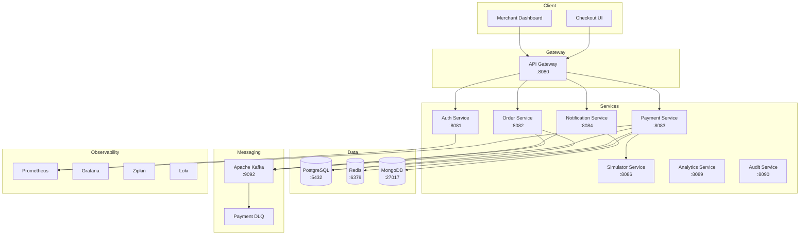
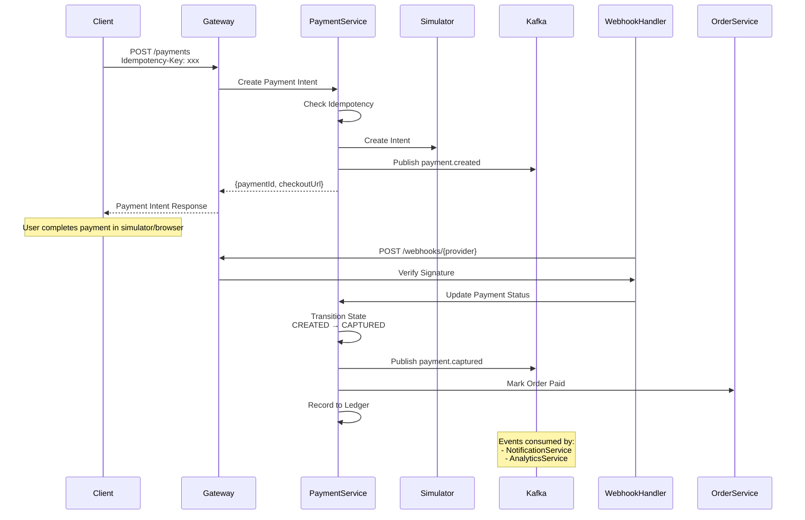

# PayFlow - Enterprise Payment Gateway

Cloud-native, production-grade payment platform built with Spring Boot microservices, Apache Kafka eventing, PostgreSQL, Redis, and React.


---

## 🎯 Key Features

- **Multi-Provider Support**: Stripe, Razorpay, PayPal, Simulator
- **Idempotent Operations**: Safe retries with idempotency keys
- **Event-Driven Architecture**: Kafka-based async communication
- **Webhook Processing**: Signature verification, deduplication, retry logic
- **Dispute/Chargeback Handling**: Full lifecycle management
- **Circuit Breakers**: Resilience4j for provider failures
- **Outbox Pattern**: Reliable event publishing
- **Structured Observability**: Metrics, tracing, logging

---

## 🏗️ Architecture


```mermaid
graph TB
    subgraph Client
        UI[Checkout UI]
        Dashboard[Merchant Dashboard]
    end

    subgraph Gateway
        AG[API Gateway<br/>:8080]
    end

    subgraph Services
        Auth[Auth Service<br/>:8081]
        Order[Order Service<br/>:8082]
        Payment[Payment Service<br/>:8083]
        Notification[Notification Service<br/>:8084]
        Simulator[Simulator Service<br/>:8086]
        Analytics[Analytics Service<br/>:8089]
        Audit[Audit Service<br/>:8090]
    end

    subgraph Data
        PG[(PostgreSQL<br/>:5432)]
        Redis[(Redis<br/>:6379)]
        Mongo[(MongoDB<br/>:27017)]
    end

    subgraph Messaging
        Kafka[Apache Kafka<br/>:9092]
        DLQ[Payment DLQ]
    end

    subgraph Observability
        Prometheus[Prometheus]
        Grafana[Grafana]
        Zipkin[Zipkin]
        Loki[Loki]
    end

    UI --> AG
    Dashboard --> AG
    AG --> Auth
    AG --> Order
    AG --> Payment
    AG --> Notification
    Payment --> Simulator
    Payment --> PG
    Payment --> Redis
    Payment --> Kafka
    Order --> PG
    Order --> Kafka
    Notification --> Kafka
    Notification --> Mongo
    Kafka --> DLQ
    Payment --> Prometheus
    Auth --> Prometheus
```

---

## 💳 Payment Flow


```mermaid
sequenceDiagram
    participant Client
    participant Gateway
    participant PaymentService
    participant Simulator
    participant Kafka
    participant WebhookHandler
    participant OrderService

    Client->>Gateway: POST /payments<br/>Idempotency-Key: xxx
    Gateway->>PaymentService: Create Payment Intent
    PaymentService->>PaymentService: Check Idempotency
    PaymentService->>Simulator: Create Intent
    PaymentService->>Kafka: Publish payment.created
    PaymentService-->>Gateway: {paymentId, checkoutUrl}
    Gateway-->>Client: Payment Intent Response

    Note over Client: User completes payment in simulator/browser

    WebhookHandler->>Gateway: POST /webhooks/{provider}
    Gateway->>WebhookHandler: Verify Signature
    WebhookHandler->>PaymentService: Update Payment Status
    PaymentService->>PaymentService: Transition State<br/>CREATED → CAPTURED
    PaymentService->>Kafka: Publish payment.captured
    PaymentService->>OrderService: Mark Order Paid
    PaymentService->>PaymentService: Record to Ledger

    Note over Kafka: Events consumed by:<br/>- NotificationService<br/>- AnalyticsService
```

---

## 🔄 Payment States

```
┌──────────┐     ┌─────────┐     ┌────────────────────┐     ┌──────────┐
│ PENDING  │────►│ CREATED │────►│ AUTHORIZATION_PEND  │────►│AUTHORIZED│
└──────────┘     └─────────┘     └────────────────────┘     └──────────┘
     │               │                     │                      │
     │               │                     │                      ▼
     │               │                     │               ┌───────────┐
     │               │                     │               │ PROCESSING│
     │               │                     │               └───────────┘
     ▼               ▼                     ▼                      │
┌─────────┐     ┌─────────┐          ┌──────────┐                  │
│ FAILED  │     │ AWAITING│          │  FAILED  │                  │
└─────────┘     │   UPI   │          └──────────┘                  │
                └─────────┘                                         ▼
                                                                ┌──────────┐
                                                                │ CAPTURED │
                                                                └──────────┘
                                                                     │
     ┌───────────────────────────────────────────────────────────────┘
     ▼
┌───────────────────┐     ┌────────────────────────┐
│ PARTIALLY_REFUNDED│────►│        REFUNDED        │
└───────────────────┘     └────────────────────────┘
```

---

## 📡 Webhook Events

| Provider  | Events Handled |
|-----------|----------------|
| **Stripe** | `payment_intent.succeeded`, `payment_intent.payment_failed`, `charge.refunded` |
| **Razorpay** | `payment.captured`, `payment.authorized`, `payment.failed`, `refund.processed` |
| **PayPal** | `PAYMENT.CAPTURE.COMPLETED`, `PAYMENT.CAPTURE.DENIED`, `PAYMENT.CAPTURE.REFUNDED` |

All webhooks:
- Signature verified (HMAC/SHA-256)
- Deduplicated by event ID
- Idempotent processing

---

## 🛡️ Security

- **JWT Authentication**: HS512 signed tokens
- **RBAC**: Admin, Merchant, User roles
- **Rate Limiting**: Token bucket via Redis
- **Webhook Signature Verification**: Provider-specific HMAC validation
- **Secrets Management**: Environment variables only (no hardcoding)

---

## 📊 Observability

### Custom Metrics

| Metric | Description |
|--------|-------------|
| `payment.created.total` | Total payments created |
| `payment.captured.total` | Successfully captured payments |
| `payment.failed.total` | Failed payments |
| `payment.refunded.total` | Refunds processed |
| `webhook.received.total` | Webhooks received |
| `webhook.duplicated.total` | Duplicate webhooks rejected |
| `idempotency.hits.total` | Idempotency cache hits |
| `payment.provider.latency` | Provider response time |
| `payment.capture.duration` | Payment capture latency |

### Alert Conditions

```yaml
alerts:
  - name: high_failure_rate
    condition: payment.failed / payment.created > 0.1
    severity: critical
  - name: high_latency
    condition: payment.capture.p99 > 5000ms
    severity: warning
  - name: webhook_spike
    condition: rate(webhook.duplicated) > 100/min
    severity: warning
```

---

## 🚀 Quick Start

### Prerequisites

- Java 21+
- Maven 3.9+
- Docker + Docker Compose
- Node.js 20+

### Start Full Stack

```bash
# Start infrastructure + services
docker compose --profile infra --profile services up -d --build

# Verify health
curl http://localhost:8080/actuator/health

# Run payment flow demo
./scripts/demo-payment-flow.sh
```

### Key Endpoints

| Service | Endpoint | Description |
|---------|----------|-------------|
| Checkout UI | http://localhost:5173 | Payment form |
| API Gateway | http://localhost:8080 | REST API |
| Prometheus | http://localhost:9090 | Metrics |
| Grafana | http://localhost:3000 | Dashboards |
| Zipkin | http://localhost:9411 | Distributed tracing |

---

## 🔧 Configuration

### Environment Variables

```bash
# Database
DB_USERNAME=payflow
DB_PASSWORD=<strong-password>

# Redis
REDIS_PASSWORD=<redis-password>

# JWT
JWT_SECRET=<base64-encoded-512bit-key>

# Webhooks
STRIPE_WEBHOOK_SECRET=<stripe-secret>
RAZORPAY_WEBHOOK_SECRET=<razorpay-secret>
PAYPAL_WEBHOOK_ID=<paypal-webhook-id>

# Providers
STRIPE_API_KEY=<stripe-key>
RAZORPAY_API_KEY=<razorpay-key>
PAYPAL_CLIENT_ID=<paypal-client>
PAYPAL_CLIENT_SECRET=<paypal-secret>
```

---

## 📁 Project Structure

```
payflow/
├── libs/common/                    # Shared DTOs, events, exceptions
├── src/
│   ├── api-gateway/                 # Routing, auth, rate limiting (8080)
│   ├── auth-service/               # JWT, RBAC, session management (8081)
│   ├── order-service/              # Order lifecycle (8082)
│   ├── payment-service/             # Payment orchestration (8083) ⭐
│   ├── notification-service/        # Email, SMS, webhooks (8084)
│   ├── simulator-service/           # Mock payment providers (8086)
│   ├── analytics-service/           # Analytics & reporting (8089)
│   └── audit-service/                # Audit logging (8090)
├── web/
│   └── payment-page/                # Customer checkout (React 18)
├── docs/                            # API docs, architecture
└── docker-compose.yml
```

---

## 📖 Documentation

| Document | Purpose |
|----------|---------|
| [DEVELOPER_GUIDE.md](./DEVELOPER_GUIDE.md) | Local setup, debugging |
| [ARCHITECTURE.md](./ARCHITECTURE.md) | System design |
| [docs/API.md](./docs/API.md) | REST API reference |
| [docs/SERVICES.md](./docs/SERVICES.md) | Service details |
| [SECURITY.md](./SECURITY.md) | Security practices |
| [RUNBOOK.md](./RUNBOOK.md) | Incident response |
| [CONTRIBUTING.md](./CONTRIBUTING.md) | Development guidelines |

---

## 🧪 Testing

```bash
# Unit tests
mvn test -pl services/payment-service

# Integration tests
mvn verify -P integration

# Load test
k6 scripts/load-test.js
```

---

## 📜 License

MIT - See [LICENSE](LICENSE)

---

## 🤝 Contributing

See [CONTRIBUTING.md](./CONTRIBUTING.md) for development guidelines.
