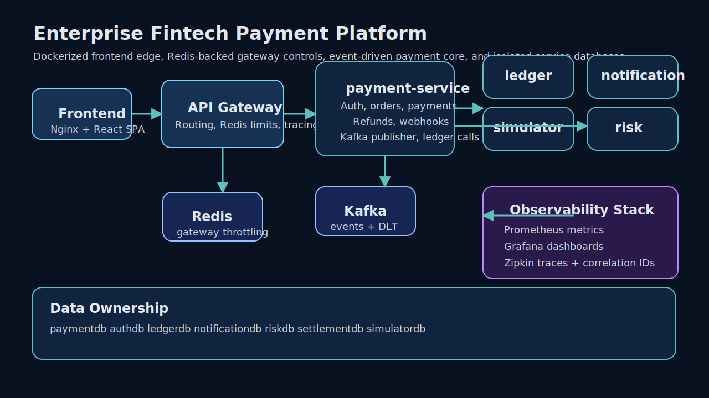
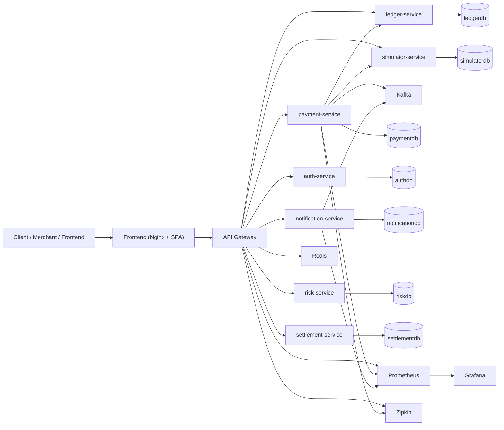
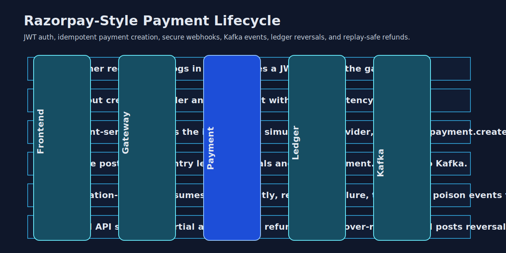
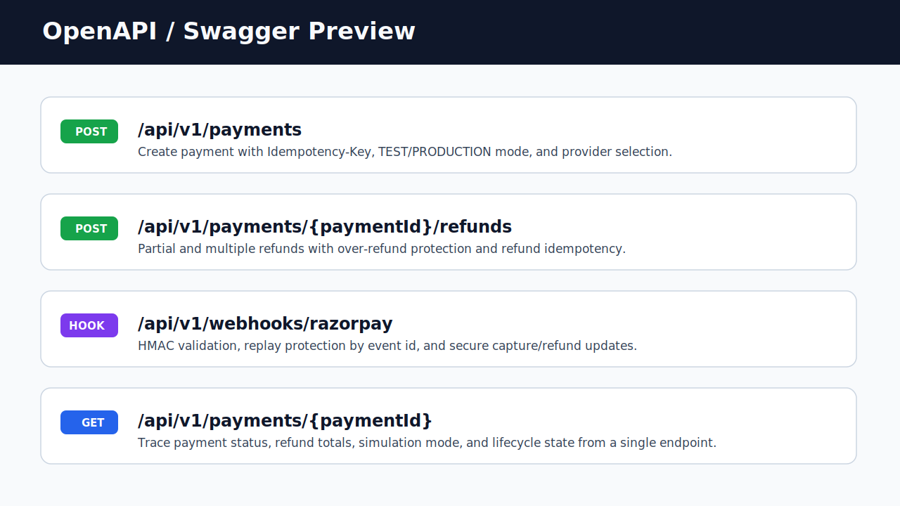

# Fintech Payment Platform


Production-grade fintech backend platform built with Java 21, Spring Boot 3.3, PostgreSQL, Kafka, Docker, and a Dockerized React checkout. The repository is structured like a real payments engineering codebase: gateway at the edge, a hardened payment core, isolated bounded-context services, versioned schemas, double-entry ledger posting, observability, and CI that validates both backend and frontend delivery paths.

## Architecture




```mermaid
flowchart LR
    Client["Client / Merchant / Frontend"] --> Nginx["Frontend (Nginx + SPA)"]
    Nginx --> Gateway["API Gateway"]

    Gateway --> Payment["payment-service"]
    Gateway --> Auth["auth-service"]
    Gateway --> Ledger["ledger-service"]
    Gateway --> Notify["notification-service"]
    Gateway --> Risk["risk-service"]
    Gateway --> Settlement["settlement-service"]
    Gateway --> Simulator["simulator-service"]

    Payment --> Kafka["Kafka"]
    Gateway --> Redis["Redis"]
    Payment --> Ledger
    Payment --> Simulator
    Notify --> Kafka

    Payment --> PayDB[("paymentdb")]
    Auth --> AuthDB[("authdb")]
    Ledger --> LedgerDB[("ledgerdb")]
    Notify --> NotifyDB[("notificationdb")]
    Risk --> RiskDB[("riskdb")]
    Settlement --> SettlementDB[("settlementdb")]
    Simulator --> SimDB[("simulatordb")]

    Gateway --> Prom["Prometheus"]
    Payment --> Prom
    Notify --> Prom
    Prom --> Grafana["Grafana"]
    Gateway --> Zipkin["Zipkin"]
    Payment --> Zipkin
```

More design detail is in [docs/ARCHITECTURE.md](docs/ARCHITECTURE.md).

## What Makes It Fintech-Grade

- Clean Architecture style module separation with `controller`, `service`, `domain`, `repository`, `config`, `security`, `dto`, and `exception`.
- JWT authentication with role-based access for `ADMIN` and `USER`.
- Razorpay-style payment lifecycle with secure webhook handling.
- Durable idempotency across payment creation, refunds, webhook processing, and Kafka consumption.
- Refund correctness with partial refunds, multiple refunds, replay protection, and over-refund prevention.
- Double-entry ledger posting for captures and refunds.
- Flyway versioned schema migrations across services.
- Kafka event flow for payment domain events, bounded retries, and dead-letter routing.
- Redis-backed rate limiting on auth and payment-facing edge routes.
- Tracing, correlation IDs, Prometheus metrics, Grafana dashboards, and Zipkin-ready tracing export.
- Testcontainers-backed payment flow coverage with PostgreSQL and Kafka.

## Services

| Service | Responsibility |
| --- | --- |
| `api-gateway` | Edge routing, retry filters, rate limiting, correlation IDs |
| `payment-service` | Auth, orders, payments, refunds, webhook handling, Kafka publishing |
| `ledger-service` | Double-entry journals and account views |
| `notification-service` | Template management and idempotent event-driven notifications |
| `auth-service` | API client lifecycle and access audit domain |
| `risk-service` | Risk scoring and decisioning |
| `settlement-service` | Settlement batch lifecycle |
| `simulator-service` | Test and production-like transaction simulation |
| `frontend` | Dockerized checkout served by Nginx |

## Core Business Flow



1. User registers or logs in and receives a JWT.
2. User creates an order through `/api/v1/orders`.
3. User creates a payment with `Idempotency-Key`.
4. `payment-service` generates a provider intent and records the initial transaction.
5. Payment capture triggers ledger posting and emits Kafka events.
6. Notification consumers persist downstream event records idempotently.
7. Refunds use their own idempotency key, create reversal entries, and cannot exceed captured value.
8. Razorpay webhook events are HMAC-validated and deduplicated by event id.

## API Versioning

All public business APIs are versioned under `/api/v1`. The gateway now explicitly rejects unsupported `/api/v2` calls so version rollout stays intentional instead of accidental. Contract notes live in [docs/CONTRACTS.md](docs/CONTRACTS.md).

## Security and Reliability

- JWT signing secret is required through environment variables or mounted secret stores.
- Gateway validates JWTs before traffic reaches protected downstream routes.
- Auth APIs now issue both short-lived access tokens and long-lived refresh tokens.
- Razorpay webhook signatures are validated with HMAC SHA-256.
- Replayed webhook events are deduplicated by stored `event_id`.
- Refund APIs require `Idempotency-Key`.
- Duplicate Kafka consumption is blocked by stored consumed event ids.
- Kafka consumers retry with backoff, then route poison messages to `payment.events.dlt`.
- Resilience4j retry and circuit breaker policies protect simulator and ledger calls.
- Redis-backed gateway rate limits are applied to auth, order, and payment endpoints.

## Observability

- Prometheus metrics exposed on `/actuator/prometheus`
- Grafana dashboard provisioned under `ops/grafana`
- Zipkin tracing endpoint support via `ZIPKIN_ENDPOINT`
- Structured logs include `traceId`, `spanId`, and `correlationId`

## Demo Proof



- Frontend edge entrypoint: `http://localhost:3000`
- Public API edge: `http://localhost:3000/api/v1/...`
- Swagger UI through the gateway: `http://localhost:8080/swagger-ui.html`
- Grafana dashboard: `http://localhost:3001`

## Quick Start

### One-Command Developer Flow

Windows PowerShell:

```powershell
./scripts/dev.ps1 doctor
./scripts/dev.ps1 hybrid
./scripts/dev.ps1 payment-local
```

macOS / Linux:

```bash
./scripts/dev.sh doctor
./scripts/dev.sh hybrid
./scripts/dev.sh payment-local
```

Useful commands:

- `doctor`: checks Java, Docker, optional Node/npm, and `.env`
- `hybrid`: starts Docker for everything except local `payment-service`
- `full`: starts the full Docker platform
- `payment-local`: runs `payment-service` with `SPRING_PROFILES_ACTIVE=local`
- `frontend-check`: runs `npm ci && npm run check` in `services/frontend`
- `verify`: runs backend Maven verification
- `compose-check`: validates Compose rendering for hybrid and full modes

### Command Matrix By OS

| Task | Windows PowerShell | Windows cmd | macOS / Linux |
| --- | --- | --- | --- |
| Doctor | `./scripts/dev.ps1 doctor` | `scripts\\dev.cmd doctor` | `./scripts/dev.sh doctor` |
| Hybrid stack | `./scripts/dev.ps1 hybrid` | `scripts\\dev.cmd hybrid` | `./scripts/dev.sh hybrid` |
| Full stack | `./scripts/dev.ps1 full` | `scripts\\dev.cmd full` | `./scripts/dev.sh full` |
| Local payment-service | `./scripts/dev.ps1 payment-local` | `scripts\\dev.cmd payment-local` | `./scripts/dev.sh payment-local` |
| Frontend check | `./scripts/dev.ps1 frontend-check` | `scripts\\dev.cmd frontend-check` | `./scripts/dev.sh frontend-check` |
| Backend verify | `./scripts/dev.ps1 verify` | `scripts\\dev.cmd verify` | `./scripts/dev.sh verify` |
| Compose validation | `./scripts/dev.ps1 compose-check` | `scripts\\dev.cmd compose-check` | `./scripts/dev.sh compose-check` |

### Full Docker

```bash
cp .env.example .env
docker compose --profile services up --build
```

Open:

- Frontend: `http://localhost:3000`
- Gateway: `http://localhost:8080`
- Payment Swagger UI: `http://localhost:8080/swagger-ui.html`
- Redis: `localhost:6379`
- Prometheus: `http://localhost:9090`
- Grafana: `http://localhost:3001`
- Zipkin: `http://localhost:9411`

### Hybrid Development

Run infrastructure and all services EXCEPT `payment-service` in Docker. This allows you to work on the payment microservice locally while the rest of the ecosystem runs seamlessly via Docker.

**1. Validate your machine**
```bash
./scripts/dev.sh doctor
```

On Windows, use:
```powershell
./scripts/dev.ps1 doctor
```

**2. Start the hybrid Docker stack**
```bash
./scripts/dev.sh hybrid
```

On Windows, use:
```powershell
./scripts/dev.ps1 hybrid
```

**3. Run `payment-service` locally**
```bash
./scripts/dev.sh payment-local
```

On Windows, use:
```powershell
./scripts/dev.ps1 payment-local
```

### Full Local (Dev) Development

If you want to run ALL Java microservices locally through your IDE, just spin up the infrastructure (DBs, Kafka, Redis, Observability):

```bash
cp .env.example .env
docker compose --profile infra up -d
```

Then run each service locally with `SPRING_PROFILES_ACTIVE=local`. Local services will automatically connect to `localhost:9092` for Kafka and `localhost:5433` for PostgreSQL.


## Testing

Fast suite:

```bash
mvn test
```

Payment flow against PostgreSQL + Kafka using Testcontainers:

```bash
mvn -pl services/payment-service -Ptestcontainers -Dtest=PaymentFlowContainersIntegrationTest test
```

Frontend quality check:

```bash
./scripts/dev.sh frontend-check
```

On Windows, use:
```powershell
./scripts/dev.ps1 frontend-check
```

Notification retry / dead-letter verification:

```bash
docker compose --profile services logs -f notification-service
```

## Example API Flow

Register:

```bash
curl -X POST http://localhost:3000/api/v1/auth/register \
  -H "Content-Type: application/json" \
  -d '{"fullName":"Rahul Sharma","email":"rahul@example.com","password":"User@1234"}'
```

Create payment:

```bash
curl -X POST http://localhost:3000/api/v1/payments \
  -H "Authorization: Bearer <JWT>" \
  -H "Idempotency-Key: pay-checkout-1001" \
  -H "Content-Type: application/json" \
  -d '{"orderId":"<ORDER_ID>","method":"UPI","provider":"RAZORPAY_SIMULATOR","transactionMode":"TEST"}'
```

Refund:

```bash
curl -X POST http://localhost:3000/api/v1/payments/<PAYMENT_ID>/refunds \
  -H "Authorization: Bearer <JWT>" \
  -H "Idempotency-Key: refund-checkout-1001" \
  -H "Content-Type: application/json" \
  -d '{"amount":499.00,"reason":"customer_request"}'
```

## Tech Decisions

- Spring Boot for service consistency and mature production tooling.
- PostgreSQL per service for data ownership boundaries.
- Kafka for event-driven domain propagation.
- Flyway for explicit schema evolution.
- Spring Cloud Gateway with Redis-backed request limiting for distributed throttling.
- Resilience4j for retry and circuit-breaker behavior.
- Micrometer + Prometheus + Grafana + Zipkin for observability.
- Docker Compose for repeatable local platform orchestration.
- GHCR image publishing workflow for stage/prod release promotion.

## Production Operations

- Contract guidance: [docs/CONTRACTS.md](docs/CONTRACTS.md)
- Operational guidance: [docs/OPERATIONS.md](docs/OPERATIONS.md)

## Production Readiness Checklist

- Versioned DB migrations
- JWT auth and RBAC
- Refund idempotency and replay-safe webhooks
- Kafka event dedupe
- Double-entry ledger journaling
- Structured logging and tracing
- Rate limiting
- Prometheus and Grafana
- CI for backend, frontend, and container builds
- Release workflow for versioned container images

## Contributing

Contribution and local development guidance is in [CONTRIBUTING.md](CONTRIBUTING.md).

## License

This repository is licensed under the [MIT License](LICENSE).
