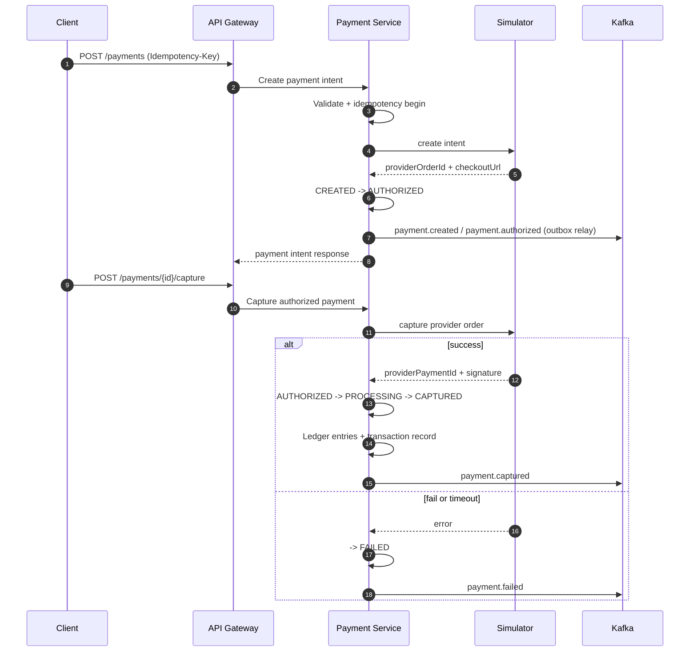
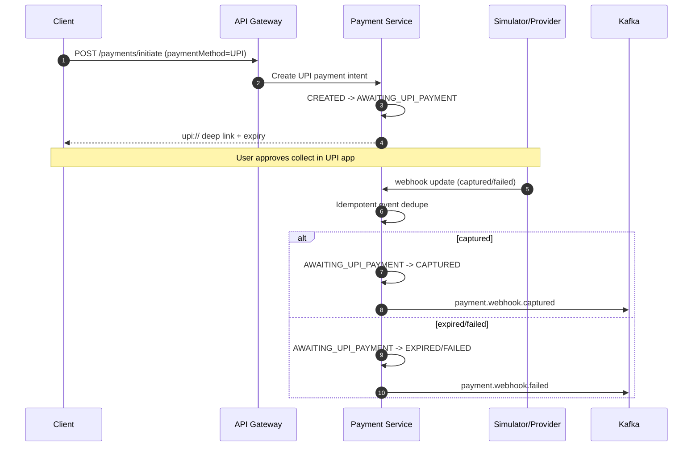

# PayFlow

Production-grade payment gateway reference implementation with realistic payment lifecycles, idempotent APIs, event-driven processing, and operational guardrails.

PayFlow models the internal architecture patterns used in systems like Stripe, Razorpay, and PayPal at project scale:
- API Gateway for edge security, rate limits, and request shaping
- Domain-owned services (payment, notification, simulator, analytics, audit)
- Kafka-driven async workflows with outbox relay and dead-letter handling
- Strong payment semantics: intent, authorization, capture, settlement, webhook reconciliation
- UPI collect flow with async completion and expiry

## Table Of Contents
- [Why This Project](#why-this-project)
- [Architecture](#architecture)
- [Payment Lifecycle](#payment-lifecycle)
- [Quick Start](#quick-start)
- [API Flows](#api-flows)
- [Repository Layout](#repository-layout)
- [Observability](#observability)
- [Testing Strategy](#testing-strategy)
- [Design Decisions](#design-decisions)
- [Roadmap](#roadmap)

## Why This Project
Most payment demos stop at "create and capture". PayFlow goes further:
- Prevents duplicate charges with idempotency records backed by PostgreSQL + Redis cache
- Uses state-machine enforcement for safe status transitions
- Publishes domain events via transactional outbox to Kafka
- Handles retries and poison messages with dead-letter topics and operational audit logs
- Supports asynchronous provider-driven outcomes through webhook listeners

## Architecture

```text
                                   +--------------------+
                                   |   React Checkout   |
                                   |  frontend/payment  |
                                   +---------+----------+
                                             |
                                             v
+--------------------------------------------------------------------------------+
|                                API Gateway (8080)                              |
| authn/authz | rate limiting | correlation-id | routing | fallback              |
+------------------+-------------------+-------------------+---------------------+
                   |                   |                   |
                   v                   v                   v
         +----------------+   +----------------+   +---------------------------+
         | Payment Service|   | Notification   |   | Simulator Service         |
         | (auth+order+   |   | Service        |   | External provider mock    |
         | payment module)|   | webhooks/event |   | success/failure/timeout   |
         +--------+-------+   +--------+-------+   +------------+--------------+
                  |                    |                         |
                  +----------+---------+-------------------------+
                             |
                             v
                      +--------------+
                      | Kafka Topics |
                      | payment.*    |
                      | webhook.*    |
                      | audit.*      |
                      +------+-------+
                             |
               +-------------+---------------+
               |                             |
               v                             v
      +------------------+           +------------------+
      | Analytics Service|           | Audit Service    |
      | risk/settlement  |           | compliance trail |
      +------------------+           +------------------+

Shared Infrastructure: PostgreSQL | Redis | Kafka | Docker Compose
```

### Service Boundaries
- `api-gateway`: edge concerns only (routing, auth filters, rate limiting, security headers)
- `payment-service`: payment intent, authorization/capture, refunds, idempotency, ledger, webhook processing
- `notification-service`: outbound webhook and notification delivery
- `simulator-service`: deterministic mock provider behavior for local and CI testing
- `analytics-service`: risk and settlement analytics
- `audit-service`: immutable compliance event log

Note: `payment-service` still contains `auth` and `order` modules in-process for local simplicity. Boundaries are preserved in package-level modules and can be extracted to dedicated deployables.

## Payment Lifecycle

### Card: Intent -> Authorization -> Capture -> Settlement


```mermaid
sequenceDiagram
    autonumber
    participant C as Client
    participant G as API Gateway
    participant P as Payment Service
    participant S as Simulator
    participant K as Kafka

    C->>G: POST /payments (Idempotency-Key)
    G->>P: Create payment intent
    P->>P: Validate + idempotency begin
    P->>S: create intent
    S-->>P: providerOrderId + checkoutUrl
    P->>P: CREATED -> AUTHORIZED
    P->>K: payment.created / payment.authorized (outbox relay)
    P-->>G: payment intent response

    C->>G: POST /payments/{id}/capture
    G->>P: Capture authorized payment
    P->>S: capture provider order
    alt success
      S-->>P: providerPaymentId + signature
      P->>P: AUTHORIZED -> PROCESSING -> CAPTURED
      P->>P: Ledger entries + transaction record
      P->>K: payment.captured
    else fail or timeout
      S-->>P: error
      P->>P: -> FAILED
      P->>K: payment.failed
    end
```

### UPI: Collect -> Pending -> Async webhook confirmation


```mermaid
sequenceDiagram
    autonumber
    participant C as Client
    participant G as API Gateway
    participant P as Payment Service
    participant S as Simulator/Provider
    participant K as Kafka

    C->>G: POST /payments/initiate (paymentMethod=UPI)
    G->>P: Create UPI payment intent
    P->>P: CREATED -> AWAITING_UPI_PAYMENT
    P-->>C: upi:// deep link + expiry

    Note over C,S: User approves collect in UPI app

    S->>P: webhook update (captured/failed)
    P->>P: Idempotent event dedupe
    alt captured
      P->>P: AWAITING_UPI_PAYMENT -> CAPTURED
      P->>K: payment.webhook.captured
    else expired/failed
      P->>P: AWAITING_UPI_PAYMENT -> EXPIRED/FAILED
      P->>K: payment.webhook.failed
    end
```

### Status Model
- Card: `PENDING -> CREATED -> AUTHORIZED -> PROCESSING -> CAPTURED`
- UPI: `PENDING -> CREATED -> AWAITING_UPI_PAYMENT -> CAPTURED|FAILED|EXPIRED`
- Refunds: `CAPTURED -> PARTIALLY_REFUNDED -> REFUNDED`

## Quick Start

### Prerequisites
- Java 21+
- Maven 3.9+
- Docker + Docker Compose
- Node.js 20+

### Setup
```bash
cp .env.example .env
make infra-up
make all-services
make frontend
```

### One Command
```bash
make dev
```

### URLs
- Gateway: `http://localhost:8080`
- Payment API: `http://localhost:8083`
- Frontend: `http://localhost:5173`

## API Flows

### 1. Create Card Payment Intent
```bash
curl -X POST http://localhost:8083/api/v1/payments \
  -H "Content-Type: application/json" \
  -H "Idempotency-Key: pay_$(uuidgen)" \
  -d '{
    "orderId": "00000000-0000-0000-0000-000000000001",
    "merchantId": "00000000-0000-0000-0000-000000000002",
    "method": "CARD",
    "provider": "RAZORPAY_SIMULATOR",
    "transactionMode": "TEST",
    "notes": "checkout|SIM_MODE=SUCCESS"
  }'
```

### 2. Capture
```bash
curl -X POST http://localhost:8083/api/v1/payments/{paymentId}/capture \
  -H "Content-Type: application/json" \
  -d '{}'
```

### 3. UPI Collect
```bash
curl -X POST http://localhost:8083/api/v1/payments/initiate \
  -H "Content-Type: application/json" \
  -H "Idempotency-Key: upi_$(uuidgen)" \
  -d '{
    "amount": 100.00,
    "currency": "INR",
    "paymentMethod": "UPI",
    "upiId": "testuser@upi",
    "merchantId": "00000000-0000-0000-0000-000000000002"
  }'
```

### 4. Status Poll
```bash
curl http://localhost:8083/api/v1/payments/{paymentId}/status
```

## Repository Layout

```text
payflow/
├── src/
│   ├── api-gateway/
│   ├── payment-service/
│   ├── notification-service/
│   ├── simulator-service/
│   ├── analytics-service/
│   └── audit-service/
├── frontend/payment-page/
├── common/
├── libs/common-config/
├── config/
│   ├── k8s/
│   ├── helm/
│   └── monitoring/
├── docker-compose.yml
├── Makefile
└── .env.example
```

## Observability
- Structured logs with correlation ID propagation across services
- Micrometer metrics for idempotency cache hits/misses, outbox success/failure, webhook counters
- Distributed tracing ready through Micrometer tracing + OTel bridge
- Centralized log/metric stack under `config/monitoring` (Prometheus, Grafana, Loki)

## Testing Strategy
- Unit tests: state machine, UPI intent, service logic
- Integration tests: payment API contracts and security behavior
- Kafka flow tests: event publication and dead-letter handling
- Frontend tests: unit + e2e checkout scenarios

Run:
```bash
make test
make test-frontend
make test-e2e
```

## Design Decisions
- Idempotency is mandatory for mutable payment APIs
- Payment state transitions are centralized in a state machine
- Outbox pattern guarantees event publishing after DB commit
- Async webhooks are deduplicated via processed-event store
- UPI and card are modeled as distinct lifecycle tracks

## Roadmap
- Extract `auth` and `order` from payment-service into independent deployables
- Add schema migrations via Flyway/Liquibase (replace `ddl-auto=update`)
- Introduce mTLS/service identity for service-to-service auth
- Add chaos testing and replay tooling for webhook recovery
- Add reconciliation dashboards and SLO alerts
