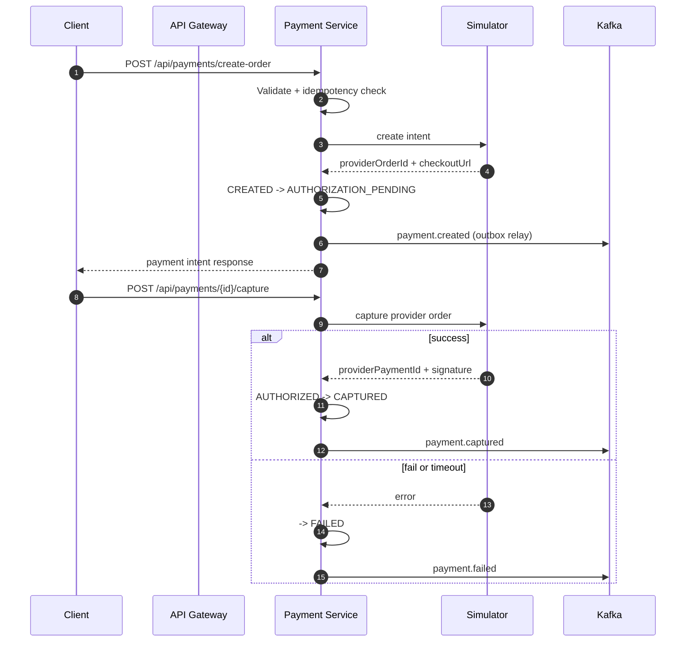
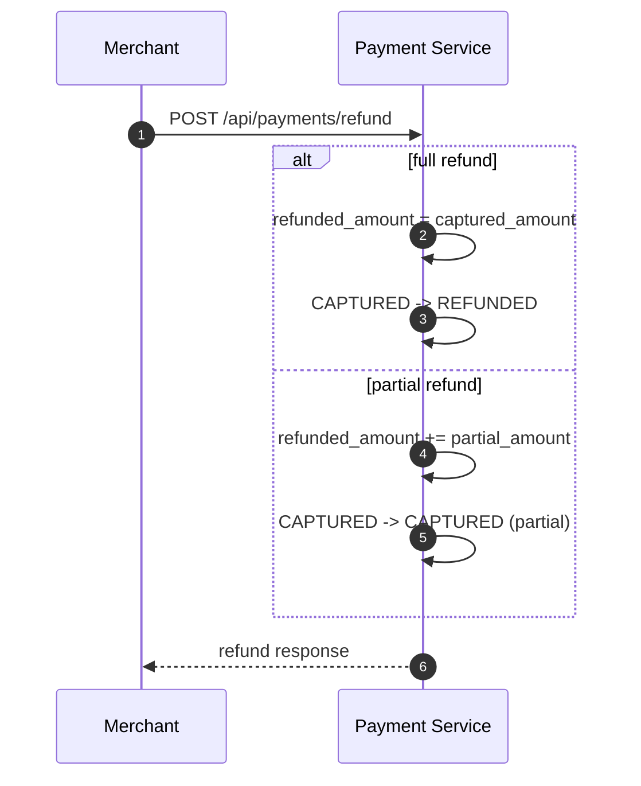

# PayFlow

[](https://github.com/payflow/payflow/actions/workflows/ci.yml)
[](https://sonarcloud.io/dashboard?id=payflow)
[](https://sonarcloud.io/dashboard?id=payflow)
[](https://www.oracle.com/java/)
[](https://spring.io/projects/spring-boot)
[](LICENSE)

Production-grade payment gateway reference implementation with realistic payment lifecycles, idempotent APIs, event-driven processing, and operational guardrails.

PayFlow models the internal architecture patterns used in systems like Stripe, Razorpay, and PayPal at project scale:
- API Gateway for edge security, rate limits, and request shaping
- Domain-owned services (auth, payment, notification, simulator, analytics, audit)
- Kafka-driven async workflows with outbox relay and dead-letter handling
- Strong payment semantics: intent, authorization, capture, refund, settlement
- Multi-currency support: INR, USD, EUR, GBP
- Full and partial refunds

## Table Of Contents
- [Why This Project](#why-this-project)
- [Architecture](#architecture)
- [Payment Lifecycle](#payment-lifecycle)
- [Quick Start](#quick-start)
- [API Reference](#api-reference)
- [Repository Layout](#repository-layout)
- [Observability](#observability)
- [Testing Strategy](#testing-strategy)
- [Design Decisions](#design-decisions)
- [Roadmap](#roadmap)

## Why This Project
Most payment demos stop at "create and capture". PayFlow goes further:
- Prevents duplicate charges with idempotency records backed by PostgreSQL + Redis cache
- Uses state-machine enforcement for safe payment status transitions
- Publishes domain events via transactional outbox to Kafka
- Handles retries and poison messages with dead-letter topics
- Supports asynchronous provider-driven outcomes through webhook listeners
- Multi-currency: INR, USD, EUR, GBP
- Full and partial refunds with amount validation

## Architecture

```text
                                    +--------------------+
                                    |   React Checkout   |
                                    |  frontend/payment  |
                                    +---------+----------+
                                              |
                                              v
+--------------------------------------------------------------------------------+
|                                API Gateway (8080)                              |
| authn/authz | rate limiting | correlation-id | routing | fallback              |
+------------------+-------------------------------+--------------------------------+
                   |                               |
                   | /api/auth/*                    | /api/payments/*
                   | (JWT required)                | (API Key required)
                   v                               v
          +-------------------+              +---------------------------+
          | Auth Service     |              | Payment Service            |
          | (8082)          |              | (8083)                   |
          |                 |              |                         |
          | • JWT tokens   |              | • payment lifecycle    |
          | • merchant    |              | • idempotency            |
          |   registration|              | • currency validation   |
          | • API keys    |              | • refunds              |
          +-----------+--------+     +------------+------------+
                      |             |
                      +------+------+
                             |
                             v
                      +--------------+
                      | Kafka Topics |
                      | payment.*    |
                      | webhook.*    |
                      | audit.*      |
                      +------+-------+
                             |
           +----------------+-------------------+
             |                               |
             v                               v
    +------------------+           +------------------+
    | Analytics Service|          | Notification     |
    | risk/settlement|          | Service          |
    +------------------+           +------------------+

Shared Infrastructure: PostgreSQL | Redis | Kafka | Docker Compose
```

### Service Boundaries
- `api-gateway`: edge concerns only (routing, JWT auth, rate limiting, security headers)
- `auth-service`: JWT authentication, merchant registration, API key management
- `payment-service`: payment intent, authorization/capture, refunds, idempotency, currency validation
- `notification-service`: outbound webhook and notification delivery
- `simulator-service`: deterministic mock provider behavior for local and CI testing
- `analytics-service`: risk and settlement analytics
- `audit-service`: immutable compliance event log

### Trust Boundaries

| Component | Zone | Authentication Method |
|----------|------|---------------------|
| Frontend | UNTRUSTED | None (calls only via API key) |
| API Gateway | BOUNDARY | JWT validation for auth routes |
| Auth Service | TRUSTED | JWT + API Key management |
| Payment Service | TRUSTED | API Key (Bearer sk_test_*) |
| Simulator | ISOLATED | None (internal) |

**Critical Rule**: Frontend MUST NEVER call payment APIs directly. All payment requests use API keys.

## Payment Lifecycle

### Card: Intent -> Authorization -> Capture -> Settlement


```mermaid
sequenceDiagram
    autonumber
    participant C as Client
    participant G as API Gateway
    participant P as Payment Service
    participant S as Simulator
    participant K as Kafka

    C->>P: POST /api/payments/create-order
    P->>P: Validate + idempotency check
    P->>S: create intent
    S-->>P: providerOrderId + checkoutUrl
    P->>P: CREATED -> AUTHORIZATION_PENDING
    P->>K: payment.created (outbox relay)
    P-->>C: payment intent response

    C->>P: POST /api/payments/{id}/capture
    P->>S: capture provider order
    alt success
      S-->>P: providerPaymentId + signature
      P->>P: AUTHORIZED -> CAPTURED
      P->>K: payment.captured
    else fail or timeout
      S-->>P: error
      P->>P: -> FAILED
      P->>K: payment.failed
    end
```

### Refund Flow


```mermaid
sequenceDiagram
    autonumber
    participant M as Merchant
    participant P as Payment Service

    M->>P: POST /api/payments/refund
    alt full refund
      P->>P: refunded_amount = captured_amount
      P->>P: CAPTURED -> REFUNDED
    else partial refund
      P->>P: refunded_amount += partial_amount
      P->>P: CAPTURED -> CAPTURED (partial)
    end
    P-->>M: refund response
```

### Payment Status States

**Card:**
```
CREATED → AUTHORIZATION_PENDING → CHALLENGE_REQUIRED → AUTHORIZED → CAPTURED
                                                              ↓
                                                         REFUNDED
```

**Refund:**
```
PENDING → PROCESSING → COMPLETED | FAILED
```

## Quick Start

### Prerequisites
- Java 21+
- Maven 3.9+
- Docker + Docker Compose

### Setup
1. Copy environment configuration:
   ```bash
   cp .env.example .env
   ```

2. Start infrastructure:
   ```bash
   make infra-up
   ```

3. Build and start all services:
   ```bash
   make all-services
   ```

4. Start frontend:
   ```bash
   make frontend
   ```

### One Command
```bash
make dev
```

### URLs
- API Gateway: `http://localhost:8080`
- Payment API: `http://localhost:8083`
- Auth API: `http://localhost:8082`
- Frontend: `http://localhost:5173`
- Swagger UI: `http://localhost:8083/swagger-ui.html`

## API Reference

### Payment Service API

#### Create Payment

```bash
curl -X POST http://localhost:8083/api/payments/create-order \
  -H "Content-Type: application/json" \
  -H "Authorization: Bearer sk_test_merchant123" \
  -H "Idempotency-Key: pay_123" \
  -d '{
    "orderId": "order_abc123",
    "amount": 500.00,
    "currency": "USD",
    "paymentMethod": "CARD"
  }'
```

**Supported Currencies:** INR, USD, EUR, GBP

**Response:**
```json
{
  "success": true,
  "data": {
    "paymentId": "uuid-here",
    "orderId": "order_abc123",
    "amount": 500.00,
    "currency": "USD",
    "status": "CREATED",
    "checkoutUrl": "/pay/uuid-here"
  }
}
```

#### Get Payment Status

```bash
curl -X GET http://localhost:8083/api/payments/status/order_abc123 \
  -H "Authorization: Bearer sk_test_merchant123"
```

#### Capture Payment

```bash
curl -X POST http://localhost:8083/api/payments/{paymentId}/capture \
  -H "Content-Type: application/json" \
  -H "Authorization: Bearer sk_test_merchant123"
```

#### Authorize Payment (Pending)

```bash
curl -X POST http://localhost:8083/api/payments/{paymentId}/authorize-pending \
   -H "Content-Type: application/json" \
   -H "Authorization: Bearer sk_test_merchant123"
```

#### Authorize Payment

```bash
curl -X POST http://localhost:8083/api/payments/{paymentId}/authorize \
   -H "Content-Type: application/json" \
   -H "Authorization: Bearer sk_test_merchant123"
```

#### Verify OTP (for 3DS)

```bash
curl -X POST http://localhost:8083/api/payments/{paymentId}/verify-otp \
  -H "Content-Type: application/json" \
  -H "Authorization: Bearer sk_test_merchant123" \
  -d '{"otp": "123456"}'
```

### Refund API

#### Create Refund

```bash
curl -X POST http://localhost:8083/api/payments/refund \
  -H "Content-Type: application/json" \
  -H "Authorization: Bearer sk_test_merchant123" \
  -d '{
    "paymentId": "uuid-here",
    "amount": 250.00,
    "reason": "Customer request"
  }'
```

**Note:** If `amount` is omitted, full refund is issued. Partial refunds are supported.

**Response:**
```json
{
  "success": true,
  "data": {
    "refundId": "ref_abc123",
    "paymentId": "uuid-here",
    "orderId": "order_abc123",
    "amount": 250.00,
    "refundedAmount": 250.00,
    "currency": "USD",
    "status": "COMPLETED",
    "reason": "Customer request",
    "createdAt": "2024-01-15T10:30:00Z"
  }
}
```

#### Get Refund Status

```bash
curl -X GET http://localhost:8083/api/payments/refund/ref_abc123 \
  -H "Authorization: Bearer sk_test_merchant123"
```

### Error Response Format

```json
{
  "success": false,
  "error": "Payment not found",
  "errorCode": "PAYMENT_NOT_FOUND"
}
```

**Error Codes:**
- `VALIDATION_ERROR` - Request validation failed
- `PAYMENT_NOT_FOUND` - Payment not found
- `INVALID_STATE_TRANSITION` - Invalid payment status transition
- `INVALID_REQUEST` - Invalid request parameters
- `PAYMENT_FAILED` - Payment processing failed
- `REFUND_FAILED` - Refund processing failed
- `IDEMPOTENCY_KEY_CONFLICT` - Duplicate idempotency key
- `CURRENCY_NOT_SUPPORTED` - Currency not supported
- `INTERNAL_ERROR` - Internal server error

## Repository Layout

```
payflow/
├── src/
│   ├── api-gateway/
│   ├── auth-service/              # JWT + API Key management
│   ├── payment-service/           # Payment + Refunds
│   ├── notification-service/
│   ├── simulator-service/
│   ├── analytics-service/
│   └── audit-service/
├── frontend/payment-page/
├── config/
│   ├── k8s/
│   ├── helm/
│   └── monitoring/
├── docker-compose.yml
├── Makefile
└── .env.example
```

## Observability
- Structured logs with correlation ID propagation across services
- Micrometer metrics for idempotency cache hits/misses, outbox success/failure
- Distributed tracing ready through Micrometer + OpenTelemetry
- Centralized log/metric stack (Prometheus, Grafana, Loki)

## Testing Strategy
- Unit tests: state machine, payment service logic
- Integration tests: API contracts and security behavior
- Kafka flow tests: event publication and dead-letter handling
- Frontend tests: unit + e2e checkout scenarios

Run:
```bash
make test
make test-frontend
```

## Security Scanning

PayFlow incorporates multiple security scanning tools to ensure code and container safety:

- **Pre-commit checks**: Uses TruffleHog to prevent secrets from being committed.
- **CI/CD Pipeline**: Includes Hadolint for Dockerfile linting and Trivy for container vulnerability scanning.
- **Dependency Scanning**: Automated updates via Dependabot and vulnerability checks in Maven and npm.
- **Static Analysis**: SonarQube for code quality and security hotspots.

## Design Decisions
- Idempotency is mandatory for mutable payment APIs
- Payment state transitions are centralized in a state machine
- Outbox pattern guarantees event publishing after DB commit
- Supported currencies: INR (default), USD, EUR, GBP
- Full and partial refunds supported
- Standardized error codes across all services
- API Key authentication for payment service
- JWT for authentication service

## Security Posture
- **Payment Service uses API Keys**: `sk_test_*` for test, `sk_live_*` for production
- **JWT used at gateway edge**: For auth routes
- **No merchantId in API requests**: Resolved from API key
- **Frontend is UNTRUSTED**: Only calls via API key

## Roadmap
- Webhook delivery system
- Subscriptions/recurring payments
- Multi-currency expansion (more currencies)
- Disputes/chargebacks
- Split payments (marketplaces)
- Schema migrations via Flyway
- mTLS for service-to-service auth