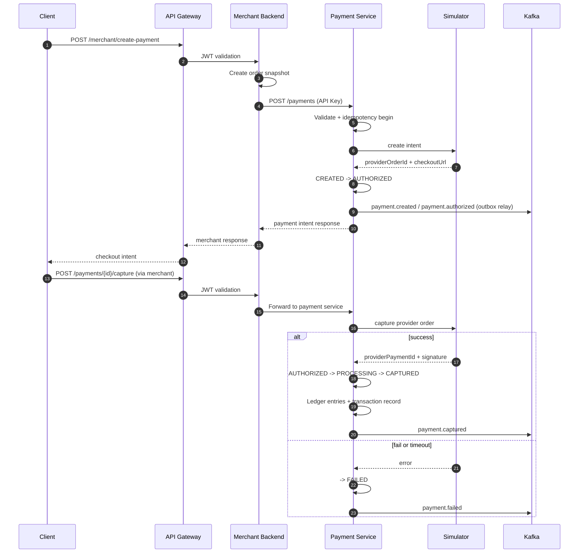
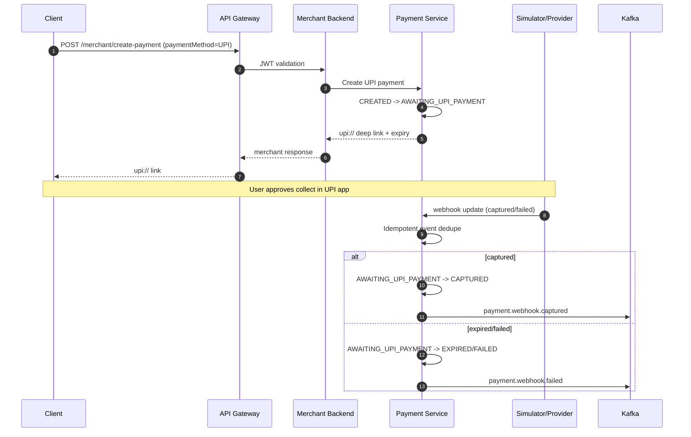

# PayFlow

Production-grade payment gateway reference implementation with realistic payment lifecycles, idempotent APIs, event-driven processing, and operational guardrails.

PayFlow models the internal architecture patterns used in systems like Stripe, Razorpay, and PayPal at project scale:
- API Gateway for edge security, rate limits, and request shaping
- Domain-owned services (payment, merchant-backend, notification, simulator, analytics, audit)
- Kafka-driven async workflows with outbox relay and dead-letter handling
- Strong payment semantics: intent, authorization, capture, settlement, webhook reconciliation
- UPI collect flow with async completion and expiry

## Table Of Contents
- [Why This Project](#why-this-project)
- [Architecture](#architecture)
- [Payment Lifecycle](#payment-lifecycle)
- [Quick Start](#quick-start)
- [API Flows](#api-flows)
- [Repository Layout](#repository-layout)
- [Observability](#observability)
- [Testing Strategy](#testing-strategy)
- [Design Decisions](#design-decisions)
- [Roadmap](#roadmap)

## Why This Project
Most payment demos stop at "create and capture". PayFlow goes further:
- Prevents duplicate charges with idempotency records backed by PostgreSQL + Redis cache
- Uses state-machine enforcement for safe status transitions
- Publishes domain events via transactional outbox to Kafka
- Handles retries and poison messages with dead-letter topics and operational audit logs
- Supports asynchronous provider-driven outcomes through webhook listeners

## Architecture

```text
                                    +--------------------+
                                    |   React Checkout   |
                                    |  frontend/payment  |
                                    +---------+----------+
                                              |
                                              v
+--------------------------------------------------------------------------------+
|                                API Gateway (8080)                              |
| authn/authz | rate limiting | correlation-id | routing | fallback              |
+------------------+-------------------------------+--------------------------------+
                   |                               |
                   | /api/v1/merchant/*           | /api/v1/payments/*
                   | (JWT required)               | (API Key required)
                   v                               v
          +-------------------+              +---------------------------+
          | Merchant Backend |              | Payment Service            |
          | (8081)          |              | (8083)                   |
          |                 |              |                         |
          | • validate JWT  |              | • payment lifecycle      |
          | • order create|              | • idempotency            |
          | • call payment|              | • Kafka/outbox           |
          | (API key auth)              | • simulator integration|
          +-----------+--------+     +------------+------------+
                      |             |
                      +------+------+
                             |
                             v
                      +--------------+
                      | Kafka Topics |
                      | payment.*    |
                      | webhook.*    |
                      | audit.*      |
                      +------+-------+
                             |
           +---------------+---------------+
           |                             |
           v                             v
   +------------------+           +------------------+
   | Analytics Service|           | Audit Service    |
   | risk/settlement  |           | compliance trail |
   +------------------+           +------------------+

Shared Infrastructure: PostgreSQL | Redis | Kafka | Docker Compose
```

### Service Boundaries
- `api-gateway`: edge concerns only (routing, JWT auth, rate limiting, security headers)
- `merchant-backend`: trusted adapter between frontend and payment service (JWT auth)
- `payment-service`: payment intent, authorization/capture, refunds, idempotency, ledger, webhook processing (API Key auth)
- `notification-service`: outbound webhook and notification delivery
- `simulator-service`: deterministic mock provider behavior for local and CI testing
- `analytics-service`: risk and settlement analytics
- `audit-service`: immutable compliance event log

### Trust Boundaries (Post-Refactor)

| Component | Zone | Authentication Method |
|----------|------|---------------------|
| Frontend | UNTRUSTED | None (calls only via gateway) |
| API Gateway | BOUNDARY | JWT validation for merchant routes |
| Merchant Backend | TRUSTED | JWT from frontend |
| Payment Service | TRUSTED | API Key (Bearer sk_test_*) |
| Simulator | ISOLATED | None (internal) |

**Critical Rule**: Frontend MUST NEVER call payment APIs directly. All payment requests flow through merchant-backend.

## Payment Lifecycle

### Card: Intent -> Authorization -> Capture -> Settlement


```mermaid
sequenceDiagram
    autonumber
    participant C as Client
    participant G as API Gateway
    participant M as Merchant Backend
    participant P as Payment Service
    participant S as Simulator
    participant K as Kafka

    C->>G: POST /merchant/create-payment
    G->>M: JWT validation
    M->>M: Create order snapshot
    M->>P: POST /payments (API Key)
    P->>P: Validate + idempotency begin
    P->>S: create intent
    S-->>P: providerOrderId + checkoutUrl
    P->>P: CREATED -> AUTHORIZED
    P->>K: payment.created / payment.authorized (outbox relay)
    P-->>M: payment intent response
    M-->>G: merchant response
    G-->>C: checkout intent

    C->>G: POST /payments/{id}/capture (via merchant)
    G->>M: JWT validation
    M->>P: Forward to payment service
    P->>S: capture provider order
    alt success
      S-->>P: providerPaymentId + signature
      P->>P: AUTHORIZED -> PROCESSING -> CAPTURED
      P->>P: Ledger entries + transaction record
      P->>K: payment.captured
    else fail or timeout
      S-->>P: error
      P->>P: -> FAILED
      P->>K: payment.failed
    end
```

### UPI: Collect -> Pending -> Async webhook confirmation


```mermaid
sequenceDiagram
    autonumber
    participant C as Client
    participant G as API Gateway
    participant M as Merchant Backend
    participant P as Payment Service
    participant S as Simulator/Provider
    participant K as Kafka

    C->>G: POST /merchant/create-payment (paymentMethod=UPI)
    G->>M: JWT validation
    M->>P: Create UPI payment
    P->>P: CREATED -> AWAITING_UPI_PAYMENT
    P-->>M: upi:// deep link + expiry
    M-->>G: merchant response
    G-->>C: upi:// link

    Note over C,S: User approves collect in UPI app

    S->>P: webhook update (captured/failed)
    P->>P: Idempotent event dedupe
    alt captured
      P->>P: AWAITING_UPI_PAYMENT -> CAPTURED
      P->>K: payment.webhook.captured
    else expired/failed
      P->>P: AWAITING_UPI_PAYMENT -> EXPIRED/FAILED
      P->>K: payment.webhook.failed
    end
```

### Status Model
- Card: `PENDING -> CREATED -> AUTHORIZED -> PROCESSING -> CAPTURED`
- UPI: `PENDING -> CREATED -> AWAITING_UPI_PAYMENT -> CAPTURED|FAILED|EXPIRED`
- Refunds: `CAPTURED -> PARTIALLY_REFUNDED -> REFUNDED`

## Quick Start

### Prerequisites
- Java 21+
- Maven 3.9+
- Docker + Docker Compose
- Node.js 20+

### Setup
```bash
cp .env.example .env
make infra-up
make all-services
make frontend
```

### One Command
```bash
make dev
```

### URLs
- Gateway: `http://localhost:8080`
- Merchant Backend: `http://localhost:8081`
- Payment API: `http://localhost:8083`
- Frontend: `http://localhost:5173`

## API Flows

### 1. Frontend initiates payment (via merchant-backend)

**Frontend sends** (ONLY productId - no financial data):
```bash
curl -X POST http://localhost:8080/api/v1/merchant/create-payment \
  -H "Content-Type: application/json" \
  -H "Authorization: Bearer <merchant_jwt>" \
  -d '{"productId": "prod_123"}'
```

**Response**:
```json
{
  "success": true,
  "data": {
    "order": {"id": "order_abc", "amount": 50000, "currency": "INR"},
    "payment": {"id": "pay_xyz", "status": "CREATED", "checkoutUrl": "..."},
    "checkoutUrl": "https://checkout.payflow.dev/pay/pay_xyz"
  }
}
```

### 2. Merchant Backend calls Payment Service (API Key auth)

```bash
curl -X POST http://localhost:8080/api/v1/payments \
  -H "Content-Type: application/json" \
  -H "Authorization: Bearer sk_test_merchant123" \
  -H "Idempotency-Key: pay_$(uuidgen)" \
  -d '{
    "order": {
      "id": "order_abc123",
      "amount": 50000,
      "currency": "INR"
    },
    "method": "CARD"
  }'
```

### 3. Capture

```bash
curl -X POST http://localhost:8080/api/v1/payments/{paymentId}/capture \
  -H "Content-Type: application/json" \
  -H "Authorization: Bearer sk_test_merchant123" \
  -d '{}'
```

### 4. UPI Collect

```bash
curl -X POST http://localhost:8080/api/v1/merchant/create-payment \
  -H "Content-Type: application/json" \
  -H "Authorization: Bearer <merchant_jwt>" \
  -d '{"productId": "prod_upi", "paymentMethod": "UPI", "upiId": "testuser@upi"}'
```

## Repository Layout

```text
payflow/
├── src/
│   ├── api-gateway/
│   ├── merchant-backend/         # NEW: Trusted adapter service
│   ├── payment-service/
│   ├── notification-service/
│   ├── simulator-service/
│   ├── analytics-service/
│   └── audit-service/
├── frontend/payment-page/
├── common/                     # Shared DTOs
├── config/
│   ├── k8s/
│   ├── helm/
│   └── monitoring/
├── docker-compose.yml
├── Makefile
└── .env.example
```

## Observability
- Structured logs with correlation ID propagation across services
- Micrometer metrics for idempotency cache hits/misses, outbox success/failure, webhook counters
- Distributed tracing ready through Micrometer tracing + OTel bridge
- Centralized log/metric stack under `config/monitoring` (Prometheus, Grafana, Loki)

## Testing Strategy
- Unit tests: state machine, UPI intent, service logic
- Integration tests: payment API contracts and security behavior
- Kafka flow tests: event publication and dead-letter handling
- Frontend tests: unit + e2e checkout scenarios

Run:
```bash
make test
make test-frontend
make test-e2e
```

## Design Decisions
- Idempotency is mandatory for mutable payment APIs
- Payment state transitions are centralized in a state machine
- Outbox pattern guarantees event publishing after DB commit
- Async webhooks are deduplicated via processed-event store
- UPI and card are modeled as distinct lifecycle tracks
- API Key authentication replaces JWT for payment service
- Order snapshots replace internal order creation
- Trust boundary enforced: frontend cannot directly call payment APIs

## Security Posture
- **Frontend is UNTRUSTED**: Only sends productId, no financial data
- **Merchant Backend is TRUSTED**: Creates order, controls amounts
- **Payment Service uses API Keys**: `sk_test_*` for test, `sk_live_*` for production
- **JWT used at gateway edge**: For merchant-backend routes only
- **No merchantId in API requests**: Resolved from API key

## Roadmap
- Add merchant registration with API key generation
- Add webhook delivery to merchant-backend
- Add schema migrations via Flyway/Liquibase (replace `ddl-auto=update`)
- Introduce mTLS/service identity for service-to-service auth
- Add chaos testing and replay tooling for webhook recovery
- Add reconciliation dashboards and SLO alerts