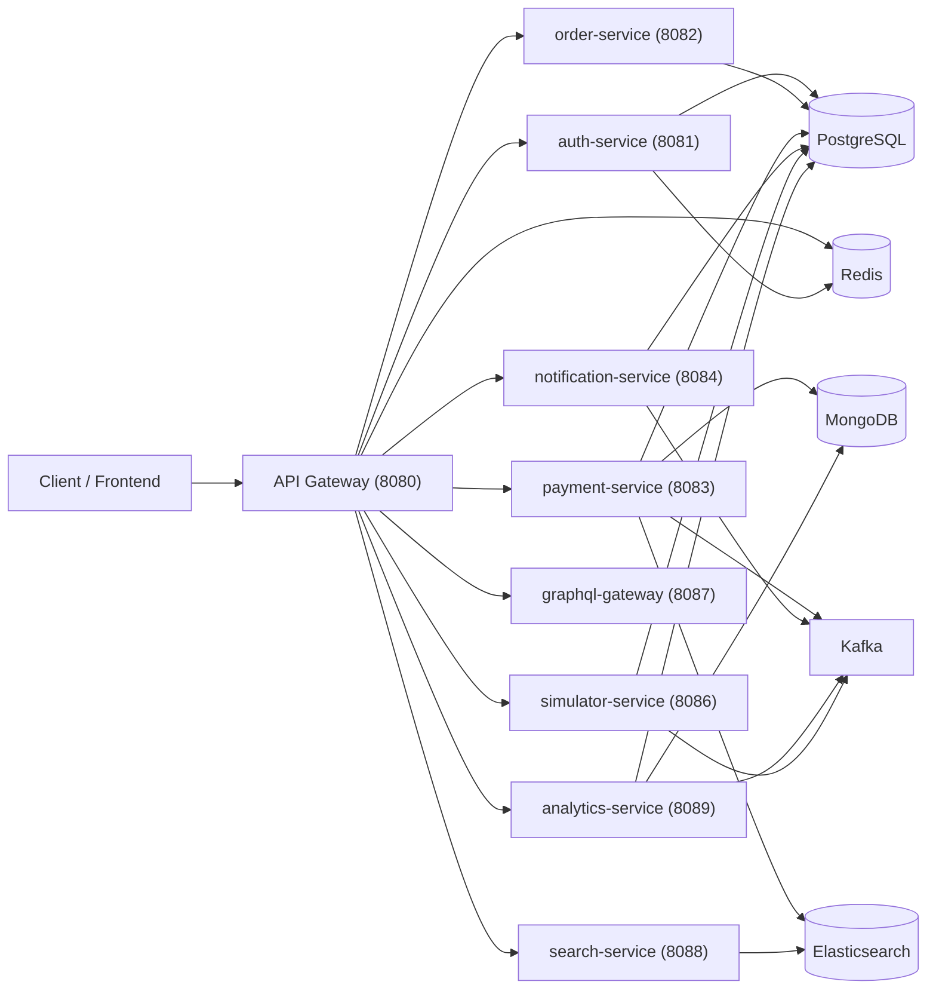

# Architecture

## Overview

PayFlow is a microservices-based payment processing platform built with Spring Boot 3, Kafka, PostgreSQL, MongoDB, and React.

## Topology

## Service Responsibilities

| Service | Port | Description |
|---------|------|-------------|
| **api-gateway** | 8080 | Edge routing, Redis-backed rate limiting, JWT validation, CORS, request correlation |
| **auth-service** | 8081 | JWT auth, OAuth2, RBAC, sessions, API client lifecycle |
| **order-service** | 8082 | Order management, merchants, KYC, API keys |
| **payment-service** | 8083 | Payment orchestration, provider integration, webhooks, refunds |
| **notification-service** | 8084 | Email/SMS/push notifications, webhook delivery, feature flags |
| **simulator-service** | 8086 | Payment provider simulation, load testing, demo mode |
| **graphql-gateway** | 8087 | GraphQL API with schema federation |
| **search-service** | 8088 | Full-text search via Elasticsearch |
| **analytics-service** | 8089 | Risk scoring, settlements, disputes, revenue reports |
| **audit-service** | 8089 | Audit logging, compliance (MongoDB) |

## Infrastructure Ports

| Component | Port | Purpose |
|-----------|------|---------|
| PostgreSQL | 5433 | Transactional data |
| MongoDB | 27017 | Audit logs, event storage |
| Redis | 6379 | Cache, sessions, rate limiting |
| Kafka | 9092 | Event streaming |
| Elasticsearch | 9200 | Full-text search |
| Prometheus | 9090 | Metrics collection |
| Grafana | 3000 | Dashboards |
| Jaeger | 16686 | Distributed tracing |
| Consul | 8500 | Service discovery |

## Payment and Refund Flow

1. User registers or logs in and receives a JWT.
2. User creates an order.
3. User creates a payment with `Idempotency-Key`.
4. `payment-service` creates a provider intent and stores the payment record.
5. On capture, payment status changes to `CAPTURED` and a Kafka event is emitted.
6. Refunds require their own `Idempotency-Key` and create reverse entries.
7. Webhooks are HMAC-validated, deduped by `event_id`, and only applied once.
8. Notification consumers persist each Kafka event once by event id.

## Reliability Guarantees

- At-least-once Kafka consumption with idempotent consumers and DLT fallback
- Idempotent payment create and refund APIs
- Replay-safe webhook processing
- Flyway-managed schema evolution
- Retry and circuit-breaker protection via Resilience4j
- Redis-backed distributed throttling at the gateway edge

## Observability

- Prometheus scraping for gateway and services via Spring Boot Actuator
- Grafana dashboards for real-time monitoring
- OpenTelemetry tracing with `traceId`, `spanId`, and `correlationId`
- Structured JSON logs across all services

## Security

- JWT-based authentication with HS512 signed tokens
- RBAC (Admin, Merchant, User roles)
- Rate limiting (1000 req/min per user via Redis)
- API keys for merchant integrations
- PCI DSS compliance (tokenization, no card data storage)
- Secrets management via environment variables

## Database Per Service

Each service has its own dedicated database:

| Service | Database |
|---------|----------|
| auth-service | authdb |
| order-service | orderdb |
| payment-service | paymentdb |
| notification-service | notificationdb |
| analytics-service | analyticsdb |
| simulator-service | simulatordb |

## See Also

- [README](../README.md) - Quick start and project overview
- [SERVICE_COMMUNICATION_GUIDE.md](../SERVICE_COMMUNICATION_GUIDE.md) - Inter-service communication
- [COMPLIANCE.md](./COMPLIANCE.md) - PCI DSS and SOC 2 compliance details
- [SECURITY-CHECKLIST.md](./SECURITY-CHECKLIST.md) - Security implementation checklist
