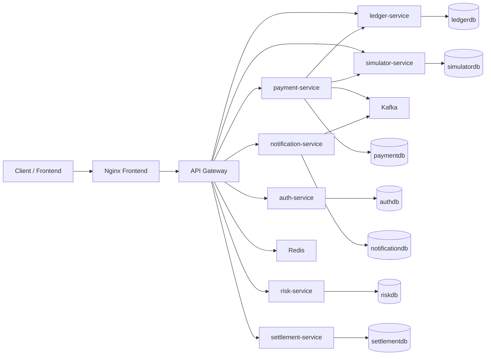

# Architecture

## Topology

## Service Responsibilities

- `api-gateway`: edge routing, Redis-backed rate limiting, retry policy, correlation header propagation
- `payment-service`: JWT auth, orders, payments, refunds, webhook validation, Kafka publishing
- `ledger-service`: double-entry journal writes and account views
- `notification-service`: notification persistence and idempotent payment-event consumption
- `auth-service`: API client lifecycle and access audit
- `risk-service`: risk scoring and decisioning
- `settlement-service`: settlement batches and payout instructions
- `simulator-service`: test provider simulation

## Payment and Refund Flow

1. User registers or logs in and receives a JWT.
2. User creates an order.
3. User creates a payment with `Idempotency-Key`.
4. `payment-service` creates a provider intent and stores the payment record.
5. On capture, payment status changes to `CAPTURED`, a ledger journal is posted, and a Kafka event is emitted.
6. Refunds require their own `Idempotency-Key`, create refund records, and post reverse journal entries.
7. Webhooks are HMAC-validated, deduped by `event_id`, and only applied once.
8. Notification consumers persist each Kafka event once by event id.

## Reliability Guarantees

- At-least-once Kafka consumption with idempotent consumers and DLT fallback
- Idempotent payment create and refund APIs
- Replay-safe webhook processing
- Double-entry journal records instead of direct balance mutation
- Flyway-managed schema evolution
- Retry and circuit-breaker protection on simulator and ledger calls
- Redis-backed distributed throttling at the gateway edge

## Observability

- Prometheus scraping for gateway and services
- Grafana dashboards provisioned from `ops/grafana`
- Zipkin-compatible tracing endpoint
- Structured logs with `traceId`, `spanId`, and `correlationId`
