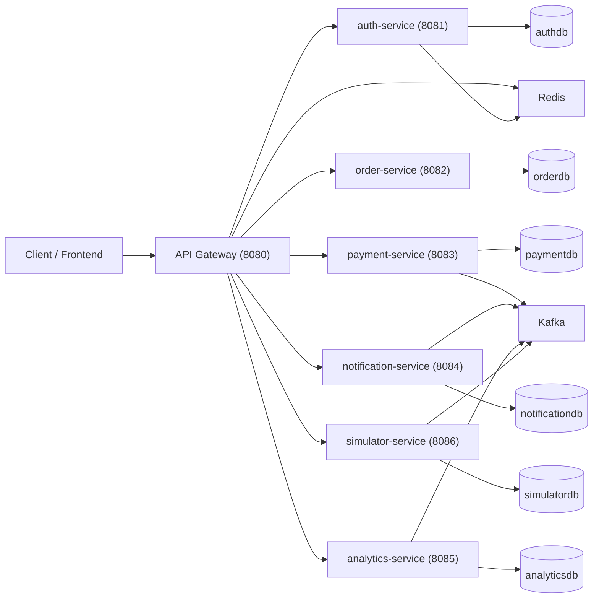

# Architecture

## Topology

## Service Responsibilities

- `api-gateway`: Edge routing, Redis-backed rate limiting, JWT validation, CORS, request correlation
- `auth-service`: JWT auth, OAuth2, RBAC, sessions, API client lifecycle
- `order-service`: Order management, merchants, KYC, API keys
- `payment-service`: Payment orchestration, provider integration, webhooks, refunds
- `notification-service`: Email/SMS/push notifications, webhook delivery, feature flags
- `analytics-service`: Risk scoring, settlements, disputes, revenue reports
- `simulator-service`: Payment provider simulation, load testing, demo mode

## Payment and Refund Flow

1. User registers or logs in and receives a JWT.
2. User creates an order.
3. User creates a payment with `Idempotency-Key`.
4. `payment-service` creates a provider intent and stores the payment record.
5. On capture, payment status changes to `CAPTURED` and a Kafka event is emitted.
6. Refunds require their own `Idempotency-Key` and create reverse entries.
7. Webhooks are HMAC-validated, deduped by `event_id`, and only applied once.
8. Notification consumers persist each Kafka event once by event id.

## Reliability Guarantees

- At-least-once Kafka consumption with idempotent consumers and DLT fallback
- Idempotent payment create and refund APIs
- Replay-safe webhook processing
- Flyway-managed schema evolution
- Retry and circuit-breaker protection via Resilience4j
- Redis-backed distributed throttling at the gateway edge

## Observability

- Prometheus scraping for gateway and services via Spring Boot Actuator
- Grafana dashboards for real-time monitoring
- OpenTelemetry tracing with `traceId`, `spanId`, and `correlationId`
- Structured JSON logs across all services
